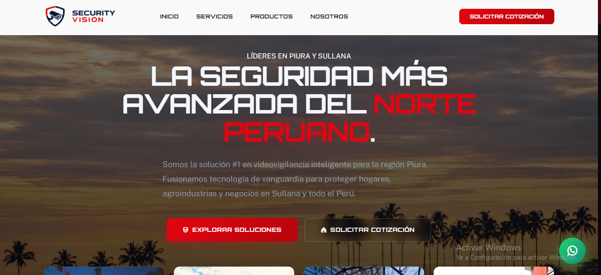

# Security Vision


Proyecto universitario de desarrollo web orientado a la creación de una landing moderna para una propuesta de videovigilancia inteligente.

Institucion academica: SENATI.

## Aviso importante

Este repositorio fue desarrollado con fines académicos.

No representa una empresa real ni una operación comercial activa.

## Vista previa



## Objetivo del proyecto

Diseñar una web atractiva, responsive y orientada a conversión para practicar:

- Estructuración de interfaces con HTML semántico.
- Organización modular de estilos CSS.
- Interacciones visuales con JavaScript puro.
- Buenas prácticas de presentación para portafolio académico.

## Características destacadas

- Hero principal con identidad visual fuerte.
- Loader inicial y transiciones de entrada.
- Header fijo con comportamiento en scroll.
- Menú móvil adaptable.
- Animaciones por aparición con Intersection Observer.
- Contadores dinámicos y sistema de partículas en canvas.
- Secciones de servicios, marcas, estadísticas y contacto.

## Stack tecnológico

| Área | Tecnologías |
|---|---|
| Estructura | HTML5 |
| Estilos | CSS3 modular |
| Interacción | JavaScript Vanilla |
| Recursos UI | Remix Icon, Google Fonts |

## Estructura del repositorio

```text
Security Vision/
├── index.html
├── script.js
├── styles.css
├── css/
│   ├── base.css
│   ├── header.css
│   ├── hero.css
│   ├── sections.css
│   └── responsive.css
├── img/
│   ├── brand/
│   ├── brands/
│   ├── content/
│   ├── industria/
│   ├── products/
│   └── testimonials/
└── pages/
    ├── contacto.html
    ├── nosotros.html
    ├── productos.html
    └── servicios.html
```

## Ejecución local

1. Abre el proyecto en VS Code.
2. Inicia un servidor local (recomendado: Live Server).
3. Abre la página principal desde index.html.

## Mejora continua

Líneas de mejora recomendadas para futuras iteraciones:

- Integrar backend para formularios reales de contacto.
- Añadir métricas de rendimiento y accesibilidad.
- Optimizar imágenes y SEO técnico.
- Publicar demo en hosting estático.

## Créditos

Trabajo desarrollado para practica academica en SENATI, orientado al estudio de desarrollo frontend.
